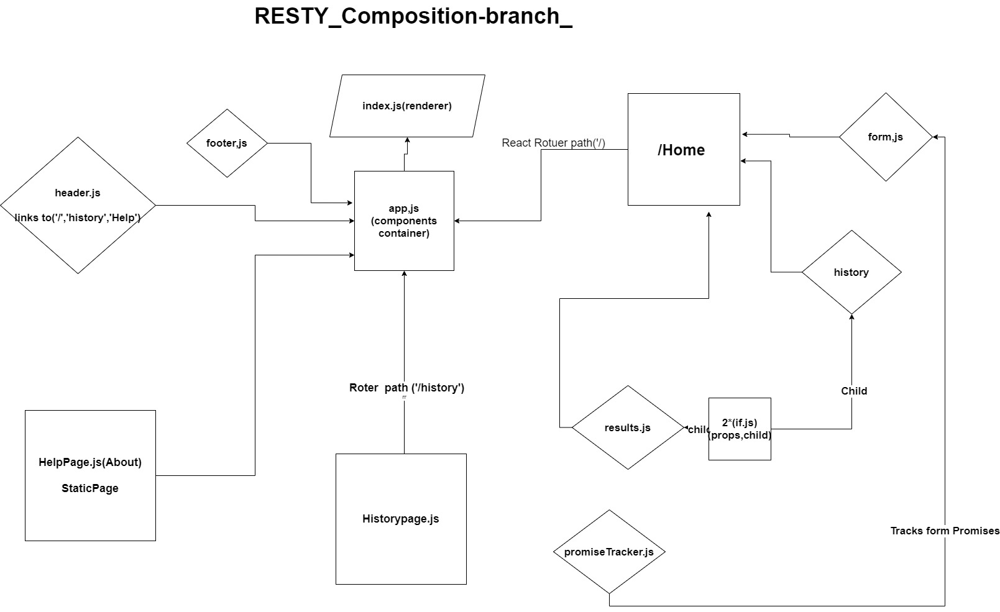

# LAB - Class:28

## Author: Mohammad Quthama

- [submission PR](https://github.com/mohammad-qethama/resty/pull/3)
- [master-deployment](https://blissful-torvalds-1a90d8.netlify.app/)

### Setup

- `PORT` - 3000

#### Dependencies

- react.
- react-dom.
- react-scripts.
- react-pre
- web-vitals
- node-sass@4.14.1
- superagent
- react-json-pretty
- react-promise-tracker
- react-loader-spinner
- react-router-dom

#### Devdependencies

- eslint

#### Running the app

- `npm start`

- find the app @(https:localhost/:3000)

#### UML

